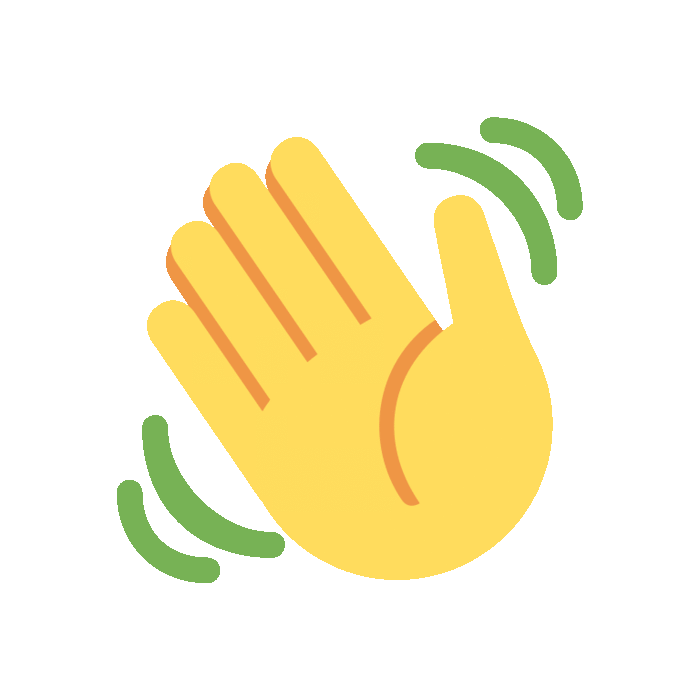

<h1 align="center">
         Hi 
         
         I'm Yashpreet Singh
</h1>
<h5 align="center">
A 1st-year student pursuing Bachelors in Computer science studies, from DIT University. I am a Web developer & learning DSA currently.
</h5>

         
         
         
         

 
          

         
- 🔭 I’m a **first year B.Tech student from DIT, Dehradun.**
  
- 🌞 I am an **open-source enthusiast** and a **front-end developer** along with other skills like C & C++.

- 📙 In my free time, I love to research about various programs and learn about open-source.

- 🌱 I’m currently focusing on **DSA.**

- 👯 I’m looking forward to **be a part of various interesting projects.**

- 🤝 I’m eager to know about **opportunities which will help me in expanding my potential.**

- ⚡ **I love to know about people and their stories.**

- 📫 How to reach me : **yashpreet1686@gmail.com**

 

<!-- <h2>Tech Stack : </h2>     -->

<!-- 

         
         
         
         
         
         
         
         
         
         
         
         
          

 -->

  <a href="https://skillicons.dev">
<!--      -->
    
    
  </a>
   
  </a>
         

         
          
         

